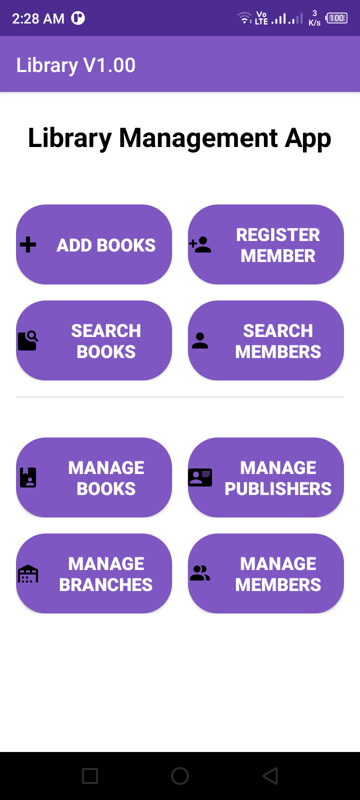

# 📚 Library App 📖

    

# Github link 

	https://github.com/lakmina456/Library_App

## **🛠️ Technologies Used**

This project was built using the following technologies.

- Java
- Sqlite
- Android Studio

## **Features**

- **📖 Multi-Page Layout**

- **🔍 Search and Filter**

- **🎨 Styled with .xml Files**

- **📱 Fully Responsive**

- **📚 Book Management**

- **👥 Member Management**

- **🏢 Publisher Management**

## **🚀 Installation**
- Clone the repository: git clone https://github.com/lakmina456/Library_App.git

## 🤝 Contributing

Contributions are welcomed with open arms! 🙌 If you'd like to contribute to this project, 
please follow these steps:

1. Fork the repository.
2. Create a new branch (git checkout -b feature/new-feature).
3. Make your changes.
4. Commit your changes (git commit -am 'Add new feature').
5. Push to the branch (git push origin feature/new-feature).
6. Create a new Pull Request.

## **Show your support**

Hit the Star button if you like this website!

## **📝 License**
This project is licensed under the MIT License.

## **📧 Contact**
If you have any questions or suggestions, feel free to reach out to me at [isurulakmina456@gmail.com].
